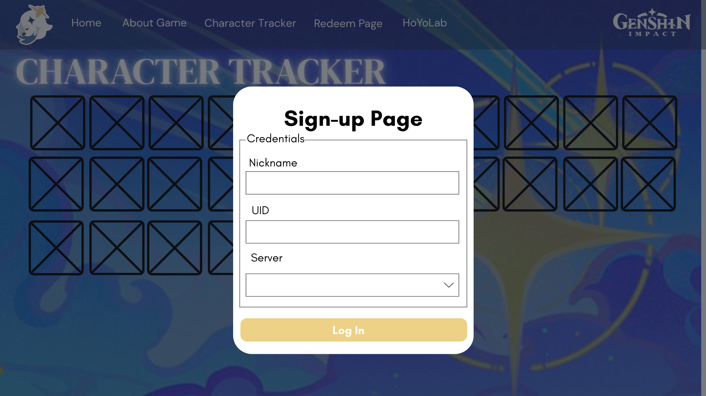
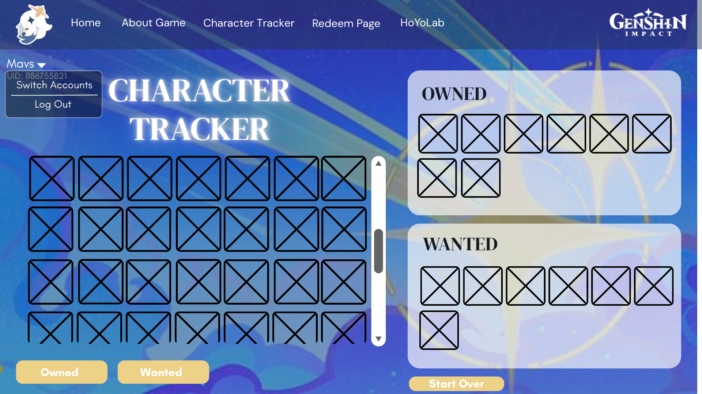
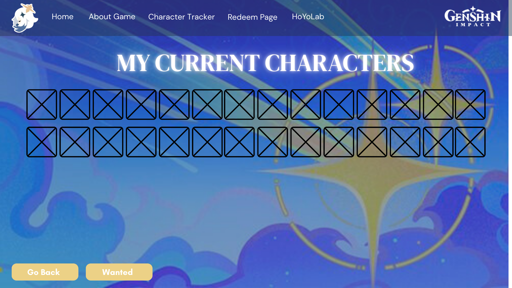
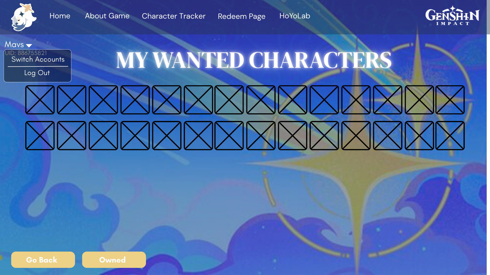

# 5 Star Genshin Character Guide 2025!

## Webpage 1: Character Tracker (Form page):
### Purpose:
#### The Character Tracker page will serve as the main webpage where users can record their progress and preferences regarding Genshin Impact characters. It allows users to indicate which characters they already own and which characters they wish to obtain. This page collects user input through an interactive HTML form and saves the data locally on the user’s device for later use across the website.

### Type of HTML Form Used:
#### The webpage uses an HTML form with interactive controls, specifically:
- Checkboxes for marking characters as Owned or Wanted
- Buttons for saving and resetting selections
- Navigation buttons to view filtered results
#### Each character is represented by a clickable icon, and the checkboxes are visually replaced with:
- ⭐ Star icon: character is owned
- ❤️ Heart icon: character is wanted
*Additionally, when clicking characters from both Tracker and Wishlist pages, the user will be redirected to the character's respective information sheet.*
#### Although the form uses checkboxes internally, JavaScript is used to control their appearance and behavior for a cleaner design. All character selections are wrapped inside an HTML <form> element to formally collect user input before being processed by JavaScript. 

### How the Form Works:
#### When a user clicks the star or heart icon beside a character:

- The form records the selection as either Owned or Wanted
- JavaScript saves the selection to localStorage
- The selected icon remains highlighted to show the user’s choice

#### Two action buttons are placed at the top or bottom of the page:

- “Show Current Characters”: directs the user to Webpage, which displays only characters marked as owned.
- “Show Wanted Characters”: directs the user to Webpage 3, which displays only characters marked as wanted.

#### These buttons allow smooth and organized navigation between pages.

### How and Where the Data Is Saved:
#### The data collected through the form is saved using the browser’s localStorage, which stores data locally on the user’s device. This method does not require an internet connection or user account, as the data is stored directly in the user’s browser on their computer.

#### Each character’s status is stored as a key-value pair, such as:

- "Venti": "owned"
- "Diluc": "wanted"

#### The data persists even after the browser is closed and is automatically retrieved when the website is reopened on the same device.

## Webpage 2: My Current Characters Page

### Purpose of the Webpage:
#### The My Current Characters page displays all Genshin Impact characters that the user has marked as owned on the Character Tracker page. This webpage allows users to easily view and review the characters they currently have without manually searching through each nation page.

### How This Webpage Uses Saved Data:
#### This webpage retrieves data from the browser’s localStorage, specifically characters that were marked with the ⭐ Star (Owned) option on Webpage 1. Only characters with the status "owned" are displayed. Characters that were not selected or marked as “wanted” are automatically hidden. If no characters have been selected, the webpage will display a message informing the user that no characters are currently recorded, encouraging them to return to the Character Tracker page.

### Navigation:
#### This webpage is accessed by clicking “Show Current Characters” on the Character Tracker page. A navigation button will also be available to allow users to return to Webpage 1.

## Webpage 3: My Wishlist

### Purpose of the Webpage:
#### The My Wishlist page displays all Genshin Impact characters that the user has marked as wanted on the Character Tracker page. This webpage allows users to easily view and review the characters they want without manually searching through each nation page.

### How This Webpage Uses Saved Data:
#### This webpage retrieves data from the browser’s localStorage, specifically characters that were marked with the ❤️ Heart (Wanted) option on Webpage 1. Only characters with the status "wanted" are displayed. Characters that were not selected or marked as “owned” are automatically hidden. If no characters have been selected, the webpage will display a message informing the user that no characters are currently recorded, encouraging them to return to the Character Tracker page.

### Navigation:
#### This webpage is accessed by clicking “Show Wanted Characters” on the Character Tracker page. A navigation button will also be available to allow users to return to Webpage 1.

## Wireframes:
### User Log In

### Webpage 1

### Webpage 2

### Webpage 3

