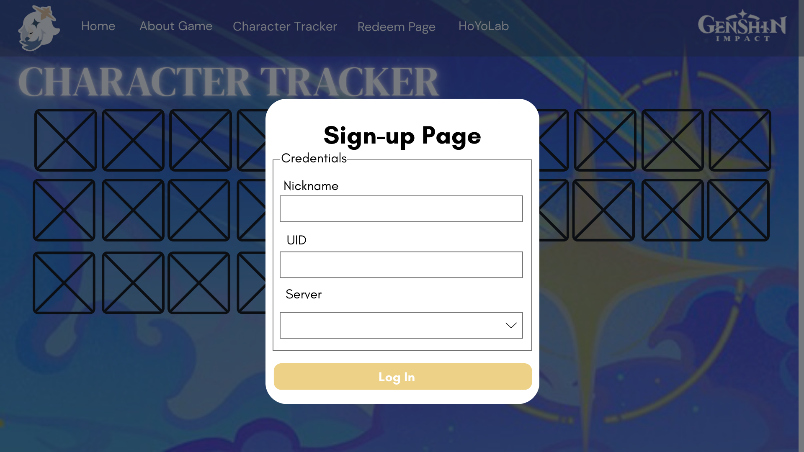
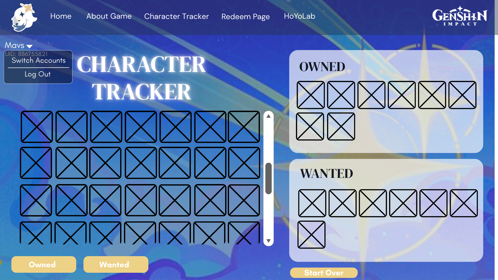
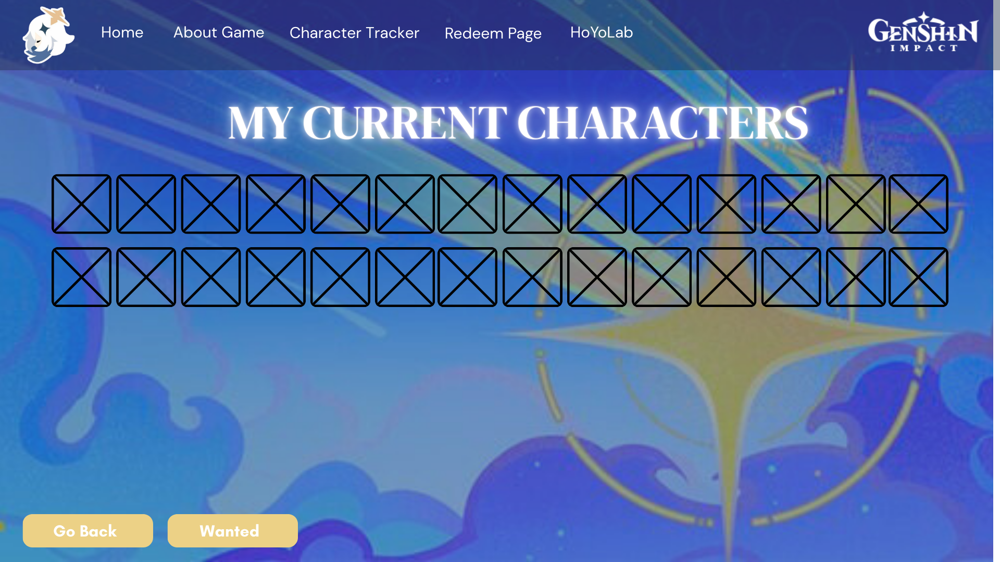
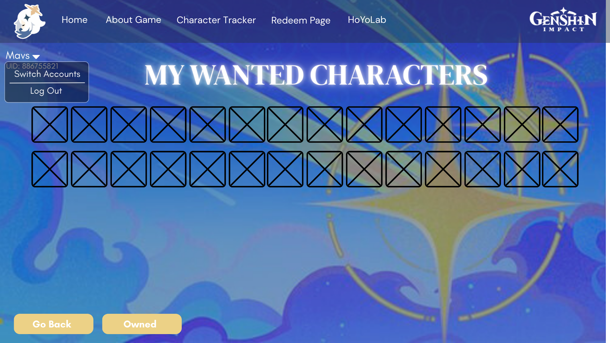
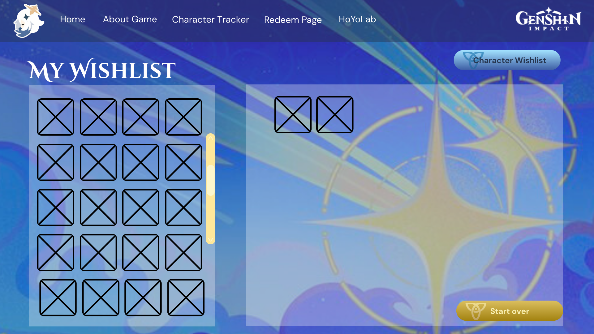

# 5 Star Genshin Character Guide 2025!

## Webpage/Pop-up 1: Log-in page (Form page):
### Purpose:
#### The Character Tracker page will serve as the main webpage where users can record their progress and preferences regarding Genshin Impact characters. It allows users to indicate which characters they already own and which characters they wish to obtain. This page collects user input through an interactive HTML form and saves the data locally on the user’s device for later use across the website.

### Type of HTML Form Used:
#### The webpage uses an HTML form with interactive controls, specifically:
- Prompting for the user's email, UID, and server.

### Character Tracker Page
Clicking the webpage will warrant a pop-up log-in page to allow the users to track their current characters and the characters that they want.

The log-in pop-up will ask for the user's email, password, and game UID.

### How the Form Works:

#### Two action buttons are placed at the top or bottom of the page:

- “Show Current Characters”: directs the user to Webpage, which displays the icons of characters waiting to be categorized via drag-and-drop.
- “Show Wanted Characters”: directs the user to Webpage 3, which displays the icons of characters waiting to be categorized via drag-and-drop.
- 
#### These buttons allow smooth and organized navigation between pages.

### How and Where the Data Is Saved:
The data collected through the form is saved using the browser’s localStorage, which stores data locally on the user’s device. This method does not require an internet connection or user account, as the data is stored directly in the user’s browser on their computer.

#### The data persists even after the browser is closed and is automatically retrieved when the website is reopened on the same device.

## Webpage 2: My Current Characters Page

### Purpose of the Webpage:
The My Current Characters page displays all Genshin Impact characters that the user has marked as owned on the Character Tracker page. This webpage allows users to easily view and review the characters they currently have without manually searching through each nation page.

### How This Webpage Uses Saved Data:
This webpage retrieves data from the browser’s localStorage by allowing them to efficiently drag their current characters into the right container. This gives the user more freedom and ease in tracking their Owned Characters. 

### Navigation:
This webpage is accessed by clicking “Show Current Characters” on the Character Tracker page. A navigation button will also be available to allow users to return to Webpage 1.

## Webpage 3: My Wishlist

### Purpose of the Webpage:
The My Wishlist page displays all Genshin Impact characters that the user has marked as wanted on the Character Tracker page. This webpage allows users to easily view and review the characters they want without manually searching through each nation page.

### How This Webpage Uses Saved Data:
This Webpage uses saved data 

### Navigation:
This webpage is accessed by clicking “Show Wanted Characters” on the Character Tracker page. A navigation button will also be available to allow users to return to Webpage 1.

# FINAL MODIFICATION PROPOSAL
## Updating of Data

## Deletion of Data
### How it will be implemented
This will be implemented by the use of a "Start over" button on the bottom right part of the menu, which clears the container in which the characters have been dropped. 
### Purpose of Deletion of Data
The purpose is to clear the data in the Character Wishlist and Character Tracker. This ensures that the user can have a fresh start in choosing and tracking their characters, allowing for a more comfortable and convenient user experience.

## Wireframes:
### User Log In

### Webpage 1

### Webpage 2

### Webpage 3

### Updating Data

### Deleting Data

